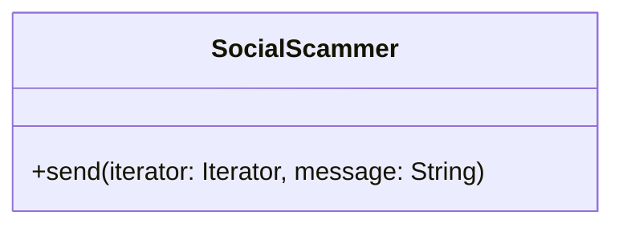
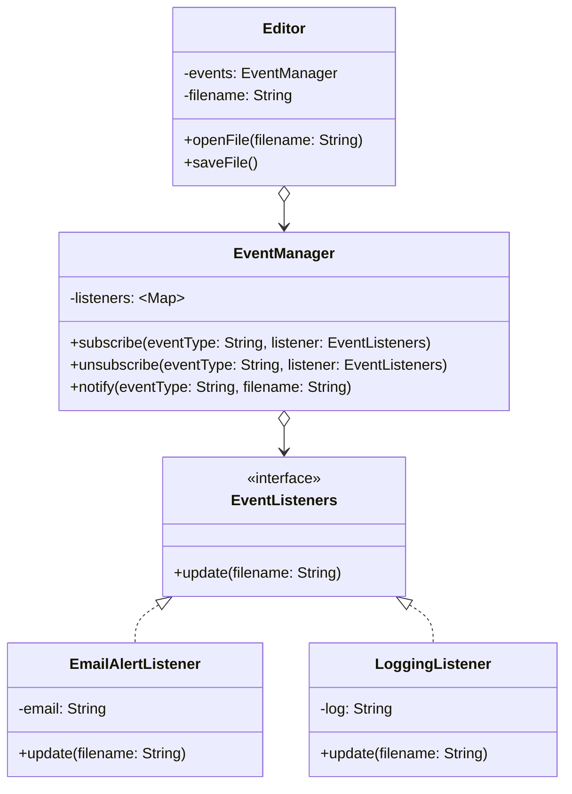
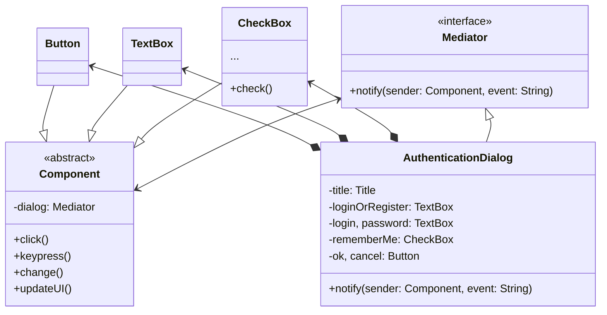
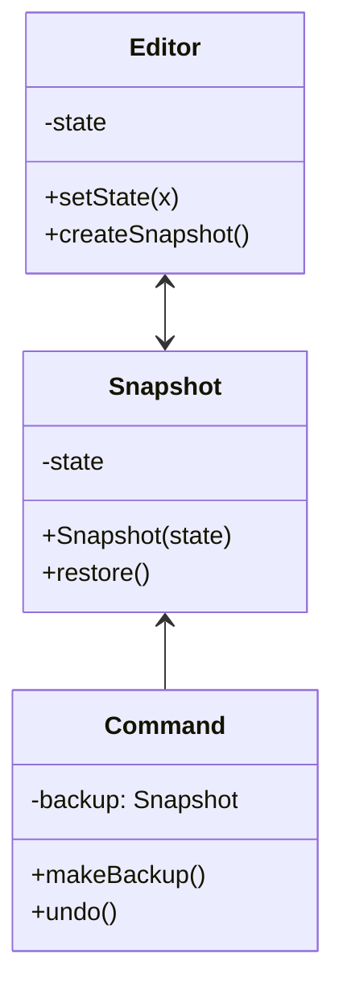
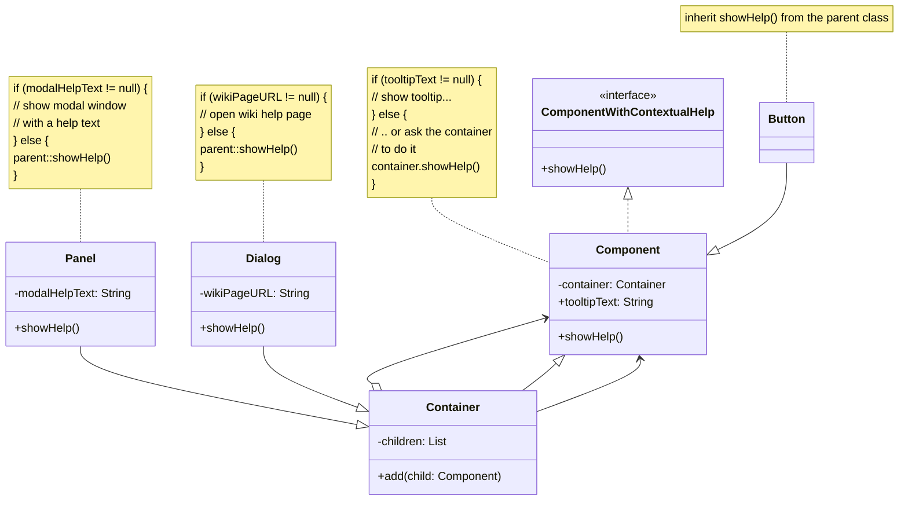

### Behavioral Patterns (Davranışsal Kalıplar):

> Nesnelerin arasındaki etkileşimi tanımlayan kalıplardır.

1. **[Iterator Pattern:](#iterator-pattern)** Bir koleksiyonun elemanları üzerinde dolaşmayı sağlayan bir kalıptır.
2. **[Observer Pattern:](#observer-pattern)** Bir nesnenin durumundaki değişiklikleri, diğer nesnelere bildirmeyi sağlayan bir kalıptır.
3. **[Mediator Pattern:](#mediator-pattern)** Nesneler arasındaki iletişimi merkezi bir nesne üzerinden yapan bir kalıptır.
4. **[Memento Pattern:](#memento-pattern)** Bir nesnenin durumunu saklamayı ve daha sonra geri yüklemeyi sağlayan bir kalıptır.
5. **[Chain of Responsibility Pattern:](#chain-of-responsibility-pattern)** Bir isteğin bir dizi nesne tarafından işlenmesini sağlayan bir kalıptır.
6. **[Command Pattern:](#command-pattern)** Bir isteği bir nesneye aktarılmasını ve daha sonra nesne tarafından işlenmesini sağlayan bir kalıptır.
7. **[Interpreter Pattern:](#interpreter-pattern)** Bir dilin ifadelerini yorumlamayı sağlayan bir kalıptır.
8. **[State Pattern:](#state-pattern)** Bir nesnenin davranışını, durumuna göre değiştiren bir kalıptır.
9. **[Strategy Pattern:](#strategy-pattern)** Bir algoritmayı birden fazla nesne tarafından kullanılmasını sağlayan bir kalıptır.
10. **[Template Method Pattern:](#template-method-pattern)**: Bir algoritmanın iskeletini tanımlayan ve bazı adımların alt sınıflar tarafından uygulanmasını sağlayan bir kalıptır.
11. **[Visitor Pattern:](#visitor-pattern)** Bir nesne yapısında dolaşmayı ve her nesne üzerinde bir işlem yapmayı sağlayan bir kalıptır.

#### Iterator Pattern

> Class Diagram:



> Java Code:

```java
public interface ProfileIterator {
    Profile getNext();
    boolean hasMore();
}

public interface SocialNetwork {
    ProfileIterator createFriendsIterator(String profileId);
    ProfileIterator createCoworkersIterator(String profileId);
}

public class Facebook implements SocialNetwork {
    public ProfileIterator createFriendsIterator(String profileId) {
        return new FacebookIterator(this, profileId, "friends");
    }
    public ProfileIterator createCoworkersIterator(String profileId) {
        return new FacebookIterator(this, profileId, "coworkers");
    }
}

public class FacebookIterator implements ProfileIterator {
    private Facebook facebook;
    private String profileId;
    private String type;
    private int currentPosition = 0;
    private List<String> cache;
    public FacebookIterator(Facebook facebook, String profileId, String type) {
        this.facebook = facebook;
        this.profileId = profileId;
        this.type = type;
    }
    private void lazyLoad() {
        if (cache == null) {
            cache = facebook.requestProfileFriendsFromFacebook(profileId, type);
        }
    }
    @Override
    public Profile getNext() {
        if (!hasMore()) {
            return null;
        }
        String friendId = cache.get(currentPosition);
        Profile friendProfile = facebook.requestProfileFromFacebook(friendId);
        currentPosition++;
        return friendProfile;
    }
    @Override
    public boolean hasMore() {
        lazyLoad();
        return currentPosition < cache.size();
    }
}

public class Profile {
    private String id;
    private String email;

    public Profile(String id, String email) {
        this.id = id;
        this.email = email;
    }

    public String getId() {
        return id;
    }

    public String getEmail() {
        return email;
    }
}

public class SocialSpammer {
    public void send(ProfileIterator iterator, String message) {
        while (iterator.hasMore()) {
            Profile profile = iterator.getNext();
            System.out.println("Sending message to " + profile.getEmail() + ": " + message);
        }
    }
}

```

[Go Top](#behavioral-patterns-davranışsal-kalıplar)

---

#### Observer Pattern

> Class Diagram:



> Java Code:

```java
public interface EventListeners {
    void update(String filename);
}

public class EventManager {
    Map<String, List<EventListeners>> listeners = new HashMap<>();

    public EventManager(String... operations) {
        for (String operation : operations) {
            this.listeners.put(operation, new ArrayList<>());
        }
    }

    public void subscribe(String eventType, EventListeners listener) {
        List<EventListeners> users = listeners.get(eventType);
        users.add(listener);
    }

    public void unsubscribe(String eventType, EventListeners listener) {
        List<EventListeners> users = listeners.get(eventType);
        users.remove(listener);
    }

    public void notify(String eventType, String filename) {
        List<EventListeners> users = listeners.get(eventType);
        for (EventListeners listener : users) {
            listener.update(filename);
        }
    }
}

public class Editor {
    public EventManager events;
    private String filename;

    public Editor() {
        this.events = new EventManager("open", "save");
    }

    public void openFile(String filename) {
        this.filename = filename;
        events.notify("open", filename);
    }

    public void saveFile() throws Exception {
        if (this.filename != null) {
            events.notify("save", filename);
        } else {
            throw new Exception("Please open a file first.");
        }
    }
}

public class EmailAlertListener implements EventListeners {
    private String email;

    public EmailAlertListener(String email) {
        this.email = email;
    }

    @Override
    public void update(String filename) {
        System.out.println("Email to " + email + ": Someone has performed " + filename + " operation with the following file: " + filename);
    }
}

public class LoggingListener implements EventListeners {
    private String log;

    public LoggingListener(String filename) {
        this.log = filename;
    }

    @Override
    public void update(String filename) {
        System.out.println("Logging to file: Someone has performed " + filename + " operation with the following file: " + filename);
    }
}

public class Demo {
    public static void main(String[] args) {
        Editor editor = new Editor();
        EventListeners emailAlertsListener = new EmailAlertListener("email@emial.com");
        EventListeners loggingListener = new LoggingListener("/path/to/log/file.txt");
        editor.events.subscribe("open", emailAlertsListener);
        editor.events.subscribe("save", emailAlertsListener);
        editor.events.subscribe("save", loggingListener);
        try {
            editor.openFile("test.txt");
            editor.saveFile();
        } catch (Exception e) {
            e.printStackTrace();
        }
    }
}
```

[Go Top](#behavioral-patterns-davranışsal-kalıplar)

---

#### Mediator Pattern

> Class Diagram:



> Java Code:

```java

public interface Mediator {
    void notify(Component sender, String event);
}

public class AuthenticationDialog implements Mediator {
    private Title title;
    private TextBox loginOrRegister;
    private TextBox login;
    private TextBox password;
    private CheckBox rememberMe;
    private Button ok;
    private Button cancel;

    @Override
    public void notify(Component sender, String event) {
        if (sender == loginOrRegister && event == "click") {
            title.setText("Log in");
            loginOrRegister.hide();
            // ...
        }
        if (sender == rememberMe && event == "check") {
            // ...
        }
        // ...
    }
}

public class Component {
    protected Mediator dialog;

    public Component(Mediator dialog) {
        this.dialog = dialog;
    }

    public void click() {
        dialog.notify(this, "click");
    }

    public void keypress() {
        dialog.notify(this, "keypress");
    }

    public void change() {
        dialog.notify(this, "change");
    }

    public abstract void updateUI();
}

public class Button extends Component {
    public Button(Mediator dialog) {
        super(dialog);
    }

    public void click() {
        dialog.notify(this, "click");
    }

    @Override
    public void updateUI() {
        // ...
    }
}

public class TextBox extends Component {
    public TextBox(Mediator dialog) {
        super(dialog);
    }

    @Override
    public void updateUI() {
        // ...
    }

    public void setText(String text) {
        // ...
    }

    public String getText() {
        // ...
    }
}

public class CheckBox extends Component {
    public CheckBox(Mediator dialog) {
        super(dialog);
    }

    @Override
    public void updateUI() {
        // ...
    }

    public boolean isChecked() {
        // ...
    }

    public void setChecked(boolean checked) {
        // ...
    }
}

public class Demo {
    public static void main(String[] args) {
        AuthenticationDialog authenticationDialog = new AuthenticationDialog();
        authenticationDialog.click();
        authenticationDialog.click();
    }
}

```

[Go Top](#behavioral-patterns-davranışsal-kalıplar)

---

#### Memento Pattern

> Class Diagram:



> Java Code:

```java
public class Editor {
    private String state;

    public void setState(String state) {
        this.state = state;
    }

    public Snapshot createSnapshot() {
        return new Snapshot(state);
    }

    public void restoreSnapshot(Snapshot snapshot) {
        this.state = snapshot.getState();
    }
}

public class Snapshot {
    private String state;

    public Snapshot(String state) {
        this.state = state;
    }

    public String getState() {
        return state;
    }
}

public class Command {
    private Editor editor;
    private Snapshot backup;

    public Command(Editor editor) {
        this.editor = editor;
    }

    public void makeBackup() {
        backup = editor.createSnapshot();
    }

    public void undo() {
        editor.restoreSnapshot(backup);
    }
}

public class Demo {
    public static void main(String[] args) {
        Editor editor = new Editor();
        Command command = new Command(editor);
        editor.setState("a");
        command.makeBackup();
        editor.setState("b");
        editor.setState("c");
        command.undo();
    }
}
```

[Go Top](#behavioral-patterns-davranışsal-kalıplar)

---

#### Chain of Responsibility Pattern

> Class Diagram:



> Java Code:

```java
public interface ComponentWithContextualHelp {
    void showHelp();
}

public class Component {
    protected Container container;
    protected String tooltipText;

    public Component(Container container) {
        this.container = container;
    }

    public void showHelp() {
        if (tooltipText != null) {
            // show tooltip...
        } else {
            // .. or ask the container
            // to do it
            container.showHelp();
        }
    }
}

public class Container {
    protected List<Component> children = new ArrayList<>();

    public void add(Component child) {
        children.add(child);
        child.container = this;
    }

    public void showHelp() {
        if (parent != null) {
            super.showHelp();
        }
    }
}

public class Panel extends Container {
    protected String modalHelpText;

    public void showHelp() {
        if (modalHelpText != null) {
            // show modal window
            // with a help text
        } else {
            super.showHelp();
        }
    }
}

public class Dialog extends Container {
    protected String wikiPageURL;

    public void showHelp() {
        if (wikiPageURL != null) {
            // open wiki help page
        } else {
            super.showHelp();
        }
    }
}

public class Demo {
    public static void main(String[] args) {
        Dialog dialog = new Dialog();
        Panel panel = new Panel();
        Button button = new Button();
        dialog.add(panel);
        panel.add(button);
        button.showHelp();
    }
}
```

[Go Top](#behavioral-patterns-davranışsal-kalıplar)

---

#### Command Pattern

[Go Top](#behavioral-patterns-davranışsal-kalıplar)

---

#### Interpreter Pattern

[Go Top](#behavioral-patterns-davranışsal-kalıplar)

---

#### State Pattern

[Go Top](#behavioral-patterns-davranışsal-kalıplar)

---

#### Strategy Pattern

[Go Top](#behavioral-patterns-davranışsal-kalıplar)

---

#### Template Method Pattern

[Go Top](#behavioral-patterns-davranışsal-kalıplar)

---

#### Visitor Pattern

[Go Top](#behavioral-patterns-davranışsal-kalıplar)
