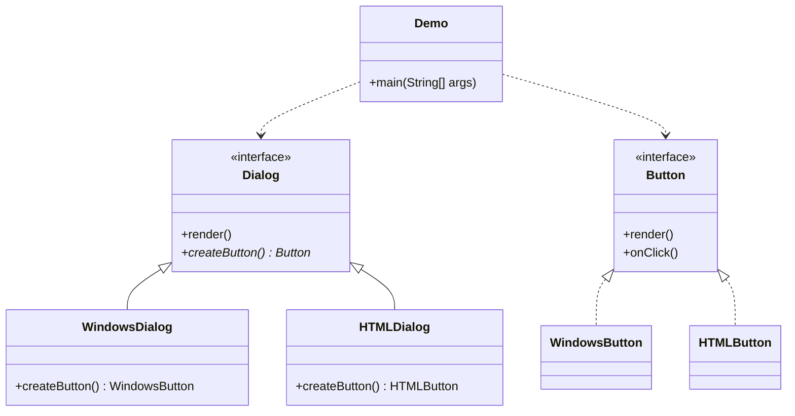
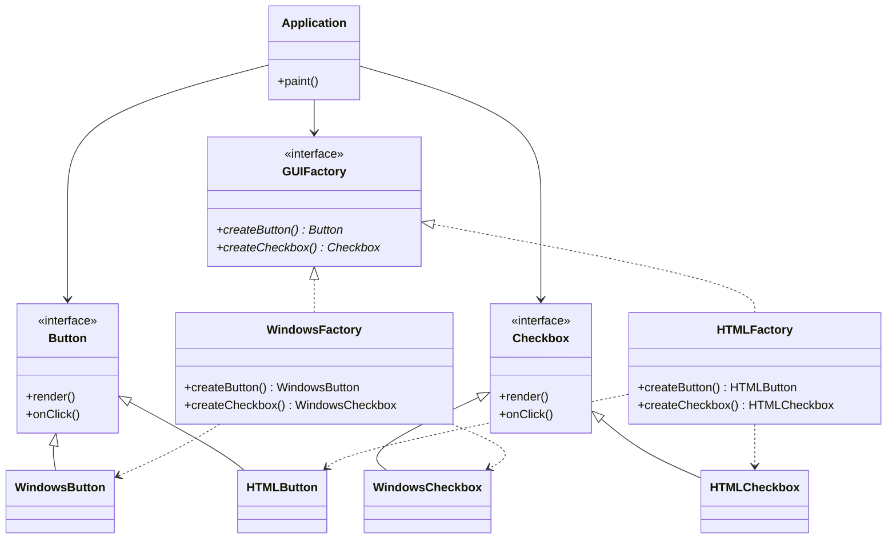
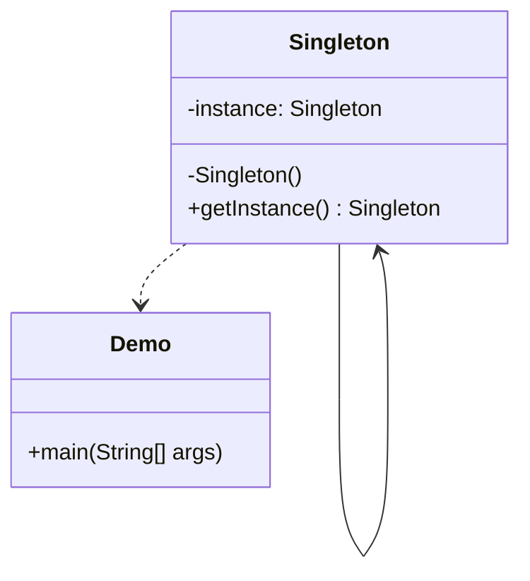
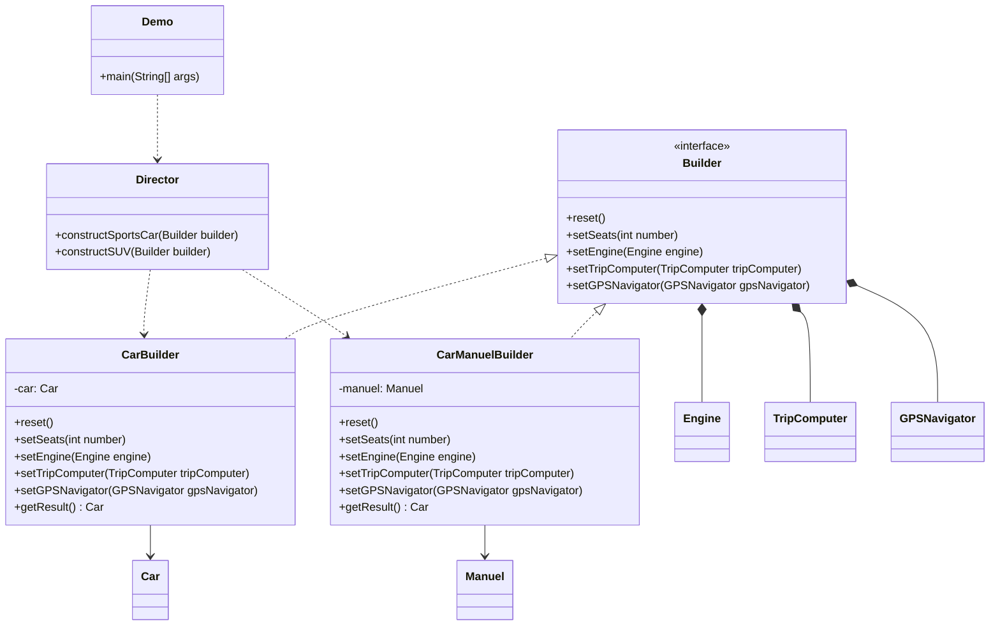
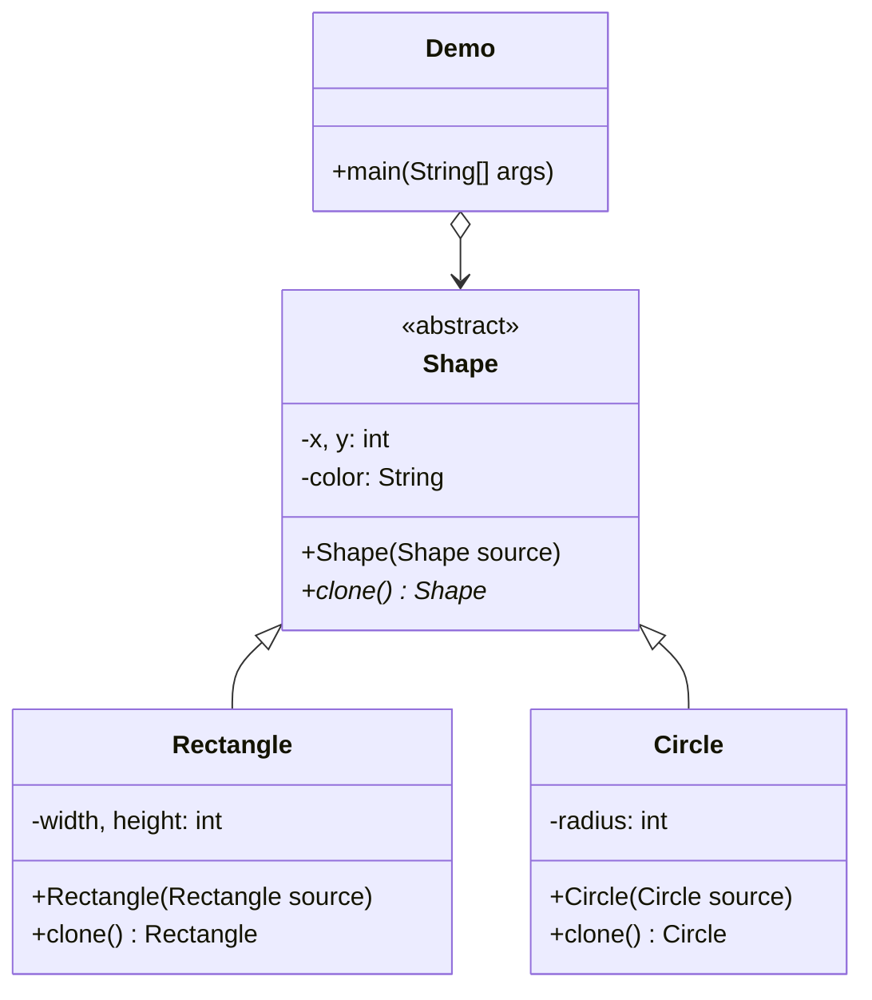

### Creational Patterns (Yaratımsal Kalıplar):

> Nesnelerin nasıl oluşturulacağını tanımlayan kalıplardır.

1. **[Factory Method:](#factory-method)** Nesnelerin oluşturulmasını soyutlayan bir kalıptır.
2. **[Abstract Factory Pattern:](#abstract-factory-pattern)** Birden fazla ilgili nesneyi tek bir çağrıyla oluşturmayı sağlar.
3. **[Singleton Pattern:](#singleton-pattern)** Bir sınıftan tek bir nesne üretilmesini sağlar.
4. **[Builder Pattern:](#builder-pattern)** Karmaşık nesnelerin adım adım oluşturulmasını sağlar.
5. **[Prototype Pattern:](#prototype-pattern)** Var olan bir nesneden, klonlanmış bir nesne oluşturmayı sağlar.

#### Factory Method

> Class Diagram:



> Java Code:

```java
public interface Button {
    void render();
    void onClick();
}

public class WindowsButton implements Button {
    @Override
    public void render() {
        System.out.println("Render Windows Button");
    }

    @Override
    public void onClick() {
        System.out.println("Click Windows Button");
    }
}

public class HTMLButton implements Button {
    @Override
    public void render() {
        System.out.println("Render HTML Button");
    }

    @Override
    public void onClick() {
        System.out.println("Click HTML Button");
    }
}

public interface Dialog {
    void render();
    void onClick();
}

public class WindowsDialog implements Dialog {
    @Override
    public void render() {
        System.out.println("Render Windows Dialog");
    }

    @Override
    public void onClick() {
        System.out.println("Click Windows Dialog");
    }
}

public class HTMLDialog implements Dialog {
    @Override
    public void render() {
        System.out.println("Render HTML Dialog");
    }

    @Override
    public void onClick() {
        System.out.println("Click HTML Dialog");
    }
}

public class Demo {
    private static Dialog dialog;
    public static void main(String[] args) {
        configure();
        runBusinessLogic();
    }

    static void configure() {
        if (System.getProperty("os.name").equals("Windows")) {
            dialog = new WindowsDialog();
        } else {
            dialog = new HTMLDialog();
        }
    }

    static void runBusinessLogic() {
        dialog.render();
        dialog.onClick();
    }
}
```

[Go Top](#creational-patterns-yaratımsal-kalıplar)

---

#### Abstract Factory Pattern

> Class Diagram:



> Java Code:

```java
public interface Button {
    void render();
    void onClick();
}

public class WindowsButton implements Button {
    @Override
    public void render() {
        System.out.println("Render Windows Button");
    }

    @Override
    public void onClick() {
        System.out.println("Click Windows Button");
    }
}

public class HTMLButton implements Button {
    @Override
    public void render() {
        System.out.println("Render HTML Button");
    }

    @Override
    public void onClick() {
        System.out.println("Click HTML Button");
    }
}

public interface Checkbox {
    void render();
    void onClick();
}

public class WindowsCheckbox implements Checkbox {
    @Override
    public void render() {
        System.out.println("Render Windows Checkbox");
    }

    @Override
    public void onClick() {
        System.out.println("Click Windows Checkbox");
    }
}

public class HTMLCheckbox implements Checkbox {
    @Override
    public void render() {
        System.out.println("Render HTML Checkbox");
    }

    @Override
    public void onClick() {
        System.out.println("Click HTML Checkbox");
    }
}

public interface GUIFactory {
    Button createButton();
    Checkbox createCheckbox();
}

public class WindowsFactory implements GUIFactory {
    @Override
    public Button createButton() {
        return new WindowsButton();
    }

    @Override
    public Checkbox createCheckbox() {
        return new WindowsCheckbox();
    }
}

public class HTMLFactory implements GUIFactory {
    @Override
    public Button createButton() {
        return new HTMLButton();
    }

    @Override
    public Checkbox createCheckbox() {
        return new HTMLCheckbox();
    }
}

public class Application {
    private Button button;
    private Checkbox checkbox;

    public Application(GUIFactory factory) {
        button = factory.createButton();
        checkbox = factory.createCheckbox();
    }

    public void paint() {
        button.render();
        checkbox.render();
    }
}

public class Demo {
    private static Application configureApplication() {
        Application app;
        GUIFactory factory;
        String osName = System.getProperty("os.name").toLowerCase();
        if (osName.contains("windows")) {
            factory = new WindowsFactory();
            app = new Application(factory);
        } else {
            factory = new HTMLFactory();
            app = new Application(factory);
        }
        return app;
    }

    public static void main(String[] args) {
        Application app = configureApplication();
        app.paint();
    }
}
```

[Go Top](#creational-patterns-yaratımsal-kalıplar)

---

#### Singleton Pattern

> Class Diagram:



> Java Code:

```java
public class Singleton {
    private static Singleton instance;
    private Singleton() {}
    public static Singleton getInstance() {
        if (instance == null) {
            instance = new Singleton();
        }
        return instance;
    }
}

public class Demo {
    public static void main(String[] args) {
        Singleton singleton = Singleton.getInstance();
    }
}
```

[Go Top](#creational-patterns-yaratımsal-kalıplar)

---

#### Builder Pattern

> Class Diagram:



> Java Code:

```java
public interface Builder {
    void reset();
    void setSeats(int number);
    void setEngine(Engine engine);
    void setTripComputer(TripComputer tripComputer);
    void setGPSNavigator(GPSNavigator gpsNavigator);
}

public class CarBuilder implements Builder {
    private Car car;

    public CarBuilder() {
        reset();
    }

    @Override
    public void reset() {
        car = new Car();
    }

    @Override
    public void setSeats(int number) {
        car.setSeats(number);
    }

    @Override
    public void setEngine(Engine engine) {
        car.setEngine(engine);
    }

    @Override
    public void setTripComputer(TripComputer tripComputer) {
        car.setTripComputer(tripComputer);
    }

    @Override
    public void setGPSNavigator(GPSNavigator gpsNavigator) {
        car.setGpsNavigator(gpsNavigator);
    }

    public Car getResult() {
        return car;
    }
}

public class CarManuelBuilder implements Builder {
    private Manuel manuel;

    public CarManuelBuilder() {
        reset();
    }

    @Override
    public void reset() {
        manuel = new CarManuelBuilder();
    }

    @Override
    public void setSeats(int number) {
        manuel.setSeats(number);
    }

    @Override
    public void setEngine(Engine engine) {
        manuel.setEngine(engine);
    }

    @Override
    public void setTripComputer(TripComputer tripComputer) {
        manuel.setTripComputer(tripComputer);
    }

    @Override
    public void setGPSNavigator(GPSNavigator gpsNavigator) {
        manuel.setGpsNavigator(gpsNavigator);
    }

    public Car getResult() {
        return manuel;
    }
}

public class Car {
    private int seats;
    private Engine engine;
    private TripComputer tripComputer;
    private GPSNavigator gpsNavigator;

    public void setSeats(int seats) {
        this.seats = seats;
    }

    public void setEngine(Engine engine) {
        this.engine = engine;
    }

    public void setTripComputer(TripComputer tripComputer) {
        this.tripComputer = tripComputer;
    }

    public void setGpsNavigator(GPSNavigator gpsNavigator) {
        this.gpsNavigator = gpsNavigator;
    }
}

public interface Engine {}

public interface TripComputer {}

public interface GPSNavigator {}

public class Manuel {
    private int seats;
    private Engine engine;
    private TripComputer tripComputer;
    private GPSNavigator gpsNavigator;

    public void setSeats(int seats) {
        this.seats = seats;
    }

    public void setEngine(Engine engine) {
        this.engine = engine;
    }

    public void setTripComputer(TripComputer tripComputer) {
        this.tripComputer = tripComputer;
    }

    public void setGpsNavigator(GPSNavigator gpsNavigator) {
        this.gpsNavigator = gpsNavigator;
    }
}


public class Director {
    public void constructSportsCar(Builder builder) {
        builder.reset();
        builder.setSeats(2);
        builder.setEngine(new Engine());
        builder.setTripComputer(new TripComputer());
        builder.setGPSNavigator(new GPSNavigator());
    }

    public void constructSUV(Builder builder) {
        builder.reset();
        builder.setSeats(4);
        builder.setEngine(new Engine());
        builder.setTripComputer(new TripComputer());
        builder.setGPSNavigator(new GPSNavigator());
    }
}

public class Demo {
    public static void main(String[] args) {
        Director director = new Director();
        CarBuilder builder = new CarBuilder();
        director.constructSportsCar(builder);
        Car car = builder.getResult();
    }
}
```

[Go Top](#creational-patterns-yaratımsal-kalıplar)

---

#### Prototype Pattern

> Class Diagram:



> Java Code:

```java
public interface Shape {
    private int x;
    private int y;
    private String color;

    public Shape(Shape source) {
        if (source != null) {
            this.x = source.x;
            this.y = source.y;
            this.color = source.color;
        }
    }

    public abstract Shape clone();
}

public class Rectangle extends Shape {
    private int width;
    private int height;

    public Rectangle(Rectangle source) {
        super(source);
        if (source != null) {
            this.width = source.width;
            this.height = source.height;
        }
    }

    @Override
    public Shape clone() {
        return new Rectangle(this);
    }
}

public class Circle extends Shape {
    private int radius;

    public Circle(Circle source) {
        super(source);
        if (source != null) {
            this.radius = source.radius;
        }
    }

    @Override
    public Shape clone() {
        return new Circle(this);
    }
}

public class Demo {
    private static List<Shape> shapes = new ArrayList<>();

    public static void main(String[] args) {
        Circle circle = new Circle();
        circle.x = 10;
        circle.y = 20;
        circle.radius = 15;
        circle.color = "red";
        shapes.add(circle);

        Circle anotherCircle = circle.clone();
        shapes.add(anotherCircle);

        Rectangle rectangle = new Rectangle();
        rectangle.width = 10;
        rectangle.height = 20;
        rectangle.color = "blue";
        shapes.add(rectangle);

        List<Shape> shapesCopy = new ArrayList<>();
        for (Shape shape : shapes) {
            shapesCopy.add(shape.clone());
        }
    }
}
```

[Go Top](#creational-patterns-yaratımsal-kalıplar)
