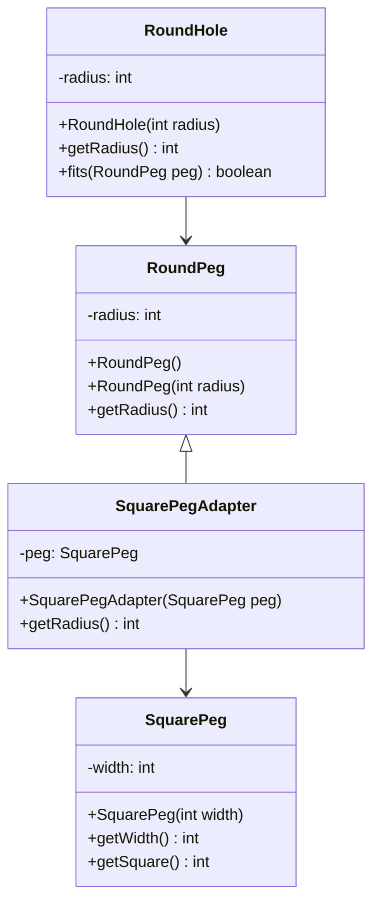
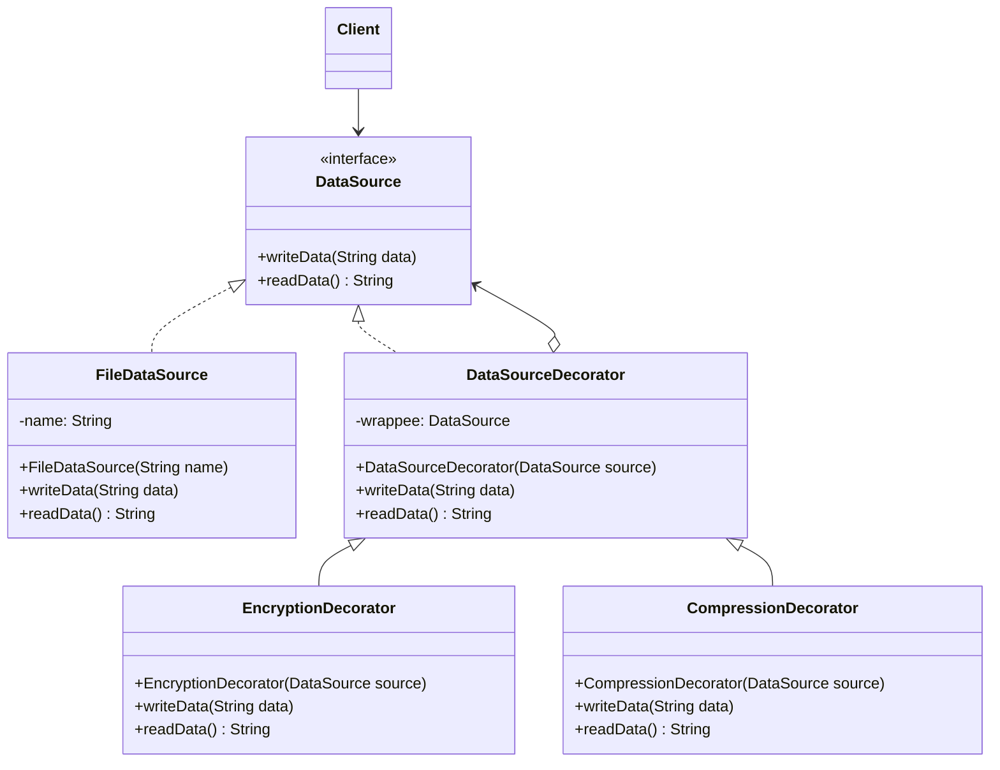
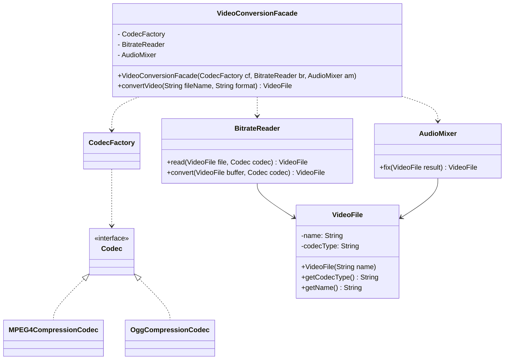
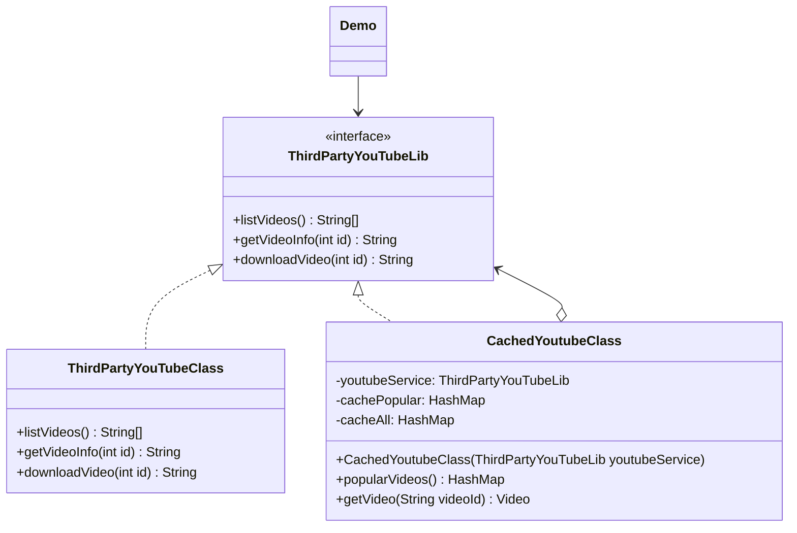
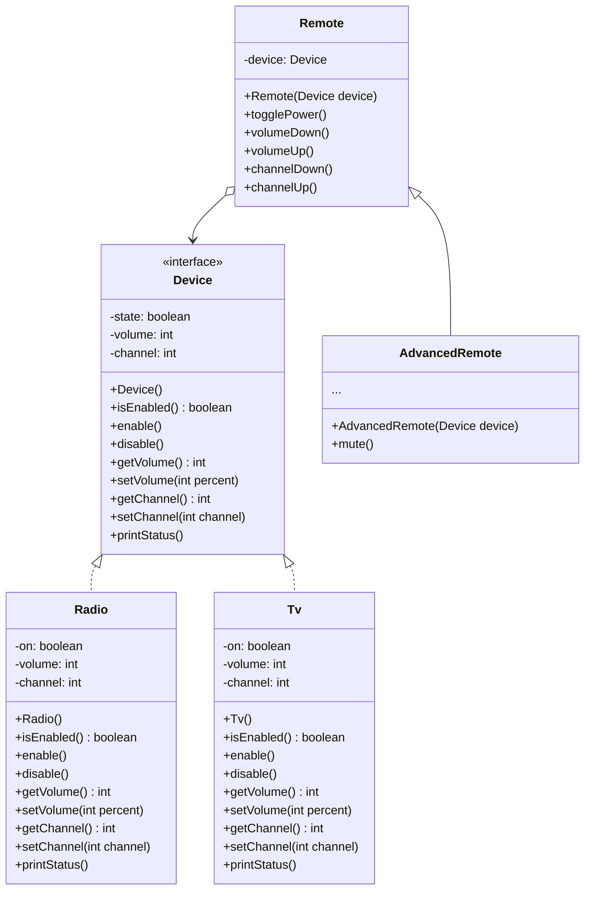
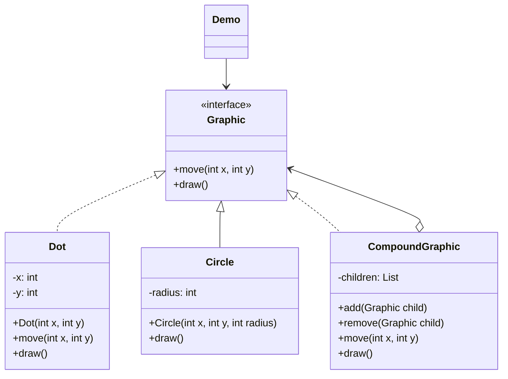
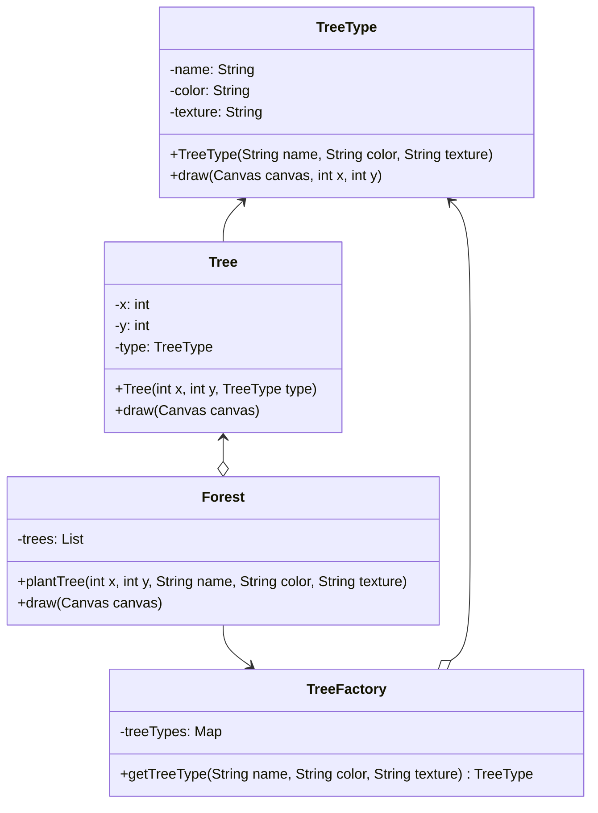

### Structural Patterns (Yapısal Kalıplar):

> Nesneler arasındaki ilişkileri tanımlayan kalıplardır.

1. **[Adapter Pattern:](#adapter-pattern)** İki uyumsuz arayüz arasında köprü oluşturmayı sağlar.
2. **[Decorator Pattern:](#decorator-pattern)** Bir nesnenin yeni özellikler eklemeden davranışını değiştirmeyi sağlar.
3. **[Facade Pattern:](#facade-pattern)** Karmaşık bir sisteme basit bir arayüz sağlar.
4. **[Proxy Pattern:](#proxy-pattern)** Bir nesnenin yerine çalışan bir nesne oluşturmayı sağlar.
5. **[Bridge Pattern:](#bridge-pattern)** Bir soyutlama ve uygulanması arasında ayrım yapmayı sağlar.
6. **[Composite Pattern:](#composite-pattern)** Nesneleri hiyerarşik bir yapı içinde organize etmeyi sağlar.
7. **[Flyweight Pattern:](#flyweight-pattern)** Çok sayıda nesne oluşturulması gerektiğinde, bellek kullanımını azaltmak için kullanılan bir kalıptır.

#### Adapter Pattern

> Class Diagram:



> Java Code:

```java
public class RoundHole {
    private int radius;

    public RoundHole(int radius) {
        this.radius = radius;
    }

    public int getRadius() {
        return radius;
    }

    public boolean fits(RoundPeg peg) {
        return this.getRadius() >= peg.getRadius();
    }
}

public class RoundPeg {
    private int radius;

    public RoundPeg() {}

    public RoundPeg(int radius) {
        this.radius = radius;
    }

    public int getRadius() {
        return radius;
    }
}

public class SquarePeg {
    private int width;

    public SquarePeg(int width) {
        this.width = width;
    }

    public int getWidth() {
        return width;
    }

    public int getSquare() {
        return (int) Math.pow(this.width, 2);
    }
}

public class SquarePegAdapter extends RoundPeg {
    private SquarePeg peg;

    public SquarePegAdapter(SquarePeg peg) {
        this.peg = peg;
    }

    @Override
    public int getRadius() {
        return (int) (peg.getWidth() * Math.sqrt(2) / 2);
    }
}

public class Demo {
    public static void main(String[] args) {
        RoundHole hole = new RoundHole(5);
        RoundPeg rpeg = new RoundPeg(5);
        if (hole.fits(rpeg)) {
            System.out.println("Round peg r5 fits round hole r5.");
        }

        SquarePeg smallSqPeg = new SquarePeg(2);
        SquarePeg largeSqPeg = new SquarePeg(20);
        SquarePegAdapter smallSqPegAdapter = new SquarePegAdapter(smallSqPeg);
        SquarePegAdapter largeSqPegAdapter = new SquarePegAdapter(largeSqPeg);
        if (hole.fits(smallSqPegAdapter)) {
            System.out.println("Square peg w2 fits round hole r5.");
        }
        if (!hole.fits(largeSqPegAdapter)) {
            System.out.println("Square peg w20 does not fit into round hole r5.");
        }
    }
}
```

[Go Top](#structural-patterns-yapısal-kalıplar)

---

#### Decorator Pattern

> Class Diagram:



> Java Code:

```java
public interface DataSource {
    void writeData(String data);
    String readData();
}

public class FileDataSource implements DataSource {
    private String name;

    public FileDataSource(String name) {
        this.name = name;
    }

    @Override
    public void writeData(String data) {
        System.out.println("Write data to file: " + name);
    }

    @Override
    public String readData() {
        System.out.println("Read data from file: " + name);
        return null;
    }
}

public class DataSourceDecorator implements DataSource {
    private DataSource wrappee;

    public DataSourceDecorator(DataSource source) {
        this.wrappee = source;
    }

    @Override
    public void writeData(String data) {
        wrappee.writeData(data);
    }

    @Override
    public String readData() {
        return wrappee.readData();
    }
}

public class EncryptionDecorator extends DataSourceDecorator {
    public EncryptionDecorator(DataSource source) {
        super(source);
    }

    @Override
    public void writeData(String data) {
        super.writeData(data);
        System.out.println("Encryption data");
    }

    @Override
    public String readData() {
        System.out.println("Decryption data");
        return super.readData();
    }
}

public class CompressionDecorator extends DataSourceDecorator {
    public CompressionDecorator(DataSource source) {
        super(source);
    }

    @Override
    public void writeData(String data) {
        super.writeData(data);
        System.out.println("Compression data");
    }

    @Override
    public String readData() {
        System.out.println("Decompression data");
        return super.readData();
    }
}

public class Demo {
    public static void main(String[] args) {
        String salaryRecords = "Name,Salary\nJohn Smith,100000\nSteven Jobs,912000";
        DataSourceDecorator encoded = new CompressionDecorator(
                new EncryptionDecorator(
                        new FileDataSource("out/OutputDemo.txt")
                )
        );
        encoded.writeData(salaryRecords);
        DataSource plain = new FileDataSource("out/OutputDemo.txt");
        System.out.println("- Input ----------------");
        System.out.println(salaryRecords);
        System.out.println("- Encoded --------------");
        System.out.println(plain.readData());
        System.out.println("- Decoded --------------");
        System.out.println(encoded.readData());
    }
}
```

[Go Top](#structural-patterns-yapısal-kalıplar)

---

#### Facade Pattern

> Class Diagram:



> Java Code:

```java
public interface Codec {}

public class MPEG4CompressionCodec implements Codec {
    public String type = "mp4";
}

public class OggCompressionCodec implements Codec {
    public String type = "ogg";
}

public class CodecFactory {
    public static Codec extract(VideoFile file) {
        String type = file.getCodecType();
        if (type.equals("mp4")) {
            System.out.println("CodecFactory: extracting mpeg audio...");
            return new MPEG4CompressionCodec();
        } else {
            System.out.println("CodecFactory: extracting ogg audio...");
            return new OggCompressionCodec();
        }
    }
}

public class BitrateReader {
    public static VideoFile read(VideoFile file, Codec codec) {
        System.out.println("BitrateReader: reading file...");
        return file;
    }

    public static VideoFile convert(VideoFile buffer, Codec codec) {
        System.out.println("BitrateReader: writing file...");
        return buffer;
    }
}

public class AudioMixer {
    public File fix(VideoFile result) {
        System.out.println("AudioMixer: fixing audio...");
        return new File("tmp");
    }
}

public class VideoFile {
    private String name;
    private String codecType;

    public VideoFile(String name) {
        this.name = name;
        this.codecType = name.substring(name.indexOf(".") + 1, name.length());
    }

    public String getCodecType() {
        return codecType;
    }

    public String getName() {
        return name;
    }
}

public class VideoConversionFacade {
    public File convertVideo(String fileName, String format) {
        System.out.println("VideoConversionFacade: conversion started.");
        VideoFile file = new VideoFile(fileName);
        Codec sourceCodec = CodecFactory.extract(file);
        Codec destinationCodec;
        if (format.equals("mp4")) {
            destinationCodec = new OggCompressionCodec();
        } else {
            destinationCodec = new MPEG4CompressionCodec();
        }
        VideoFile buffer = BitrateReader.read(file, sourceCodec);
        VideoFile intermediateResult = BitrateReader.convert(buffer, destinationCodec);
        File result = (new AudioMixer()).fix(intermediateResult);
        System.out.println("VideoConversionFacade: conversion completed.");
        return result;
    }
}

public class Demo {
    public static void main(String[] args) {
        VideoConversionFacade converter = new VideoConversionFacade();
        File mp4Video = converter.convertVideo("youtubevideo.ogg", "mp4");
    }
}
```

[Go Top](#structural-patterns-yapısal-kalıplar)

---

#### Proxy Pattern

> Class Diagram:



> Java Code:

```java
public interface ThirdPartyYouTubeLib {
    HashMap<String, Video> popularVideos();

    Video getVideo(String videoId);
}

public class CachedYoutubeClass implements ThirdPartyYouTubeLib {
    private ThirdPartyYouTubeLib youtubeService;
    private HashMap<String, Video> cachePopular = new HashMap<>();
    private HashMap<String, Video> cacheAll = new HashMap<>();

    public CachedYoutubeClass(ThirdPartyYouTubeLib youtubeService) {
        this.youtubeService = youtubeService;
    }

    @Override
    public HashMap<String, Video> popularVideos() {
        if (cachePopular.isEmpty()) {
            cachePopular = youtubeService.popularVideos();
        } else {
            System.out.println("Retrieved list from cache.");
        }
        return cachePopular;
    }

    @Override
    public Video getVideo(String videoId) {
        Video video = cacheAll.get(videoId);
        if (video == null) {
            video = youtubeService.getVideo(videoId);
            cacheAll.put(videoId, video);
        } else {
            System.out.println("Retrieved video '" + videoId + "' from cache.");
        }
        return video;
    }
}

public class ThirdPartyYouTubeClass implements ThirdPartyYouTubeLib {
    @Override
    public HashMap<String, Video> popularVideos() {
        connectToServer("http://www.youtube.com");
        return getRandomVideos();
    }

    @Override
    public Video getVideo(String videoId) {
        connectToServer("http://www.youtube.com/" + videoId);
        return getSomeVideo(videoId);
    }

    private int random(int min, int max) {
        return min + (int) (Math.random() * ((max - min) + 1));
    }

    private void experienceNetworkLatency() {
        int randomLatency = random(5, 10);
        for (int i = 0; i < randomLatency; i++) {
            try {
                Thread.sleep(100);
            } catch (InterruptedException e) {
                e.printStackTrace();
            }
        }
    }

    private void connectToServer(String server) {
        System.out.println("Connecting to " + server + "...");
        experienceNetworkLatency();
        System.out.println("Connected!");
    }

    private HashMap<String, Video> getRandomVideos() {
        System.out.println("Downloading populars...");
        experienceNetworkLatency();
        HashMap<String, Video> hmap = new HashMap<>();
        hmap.put("catzzzzzzzzz", new Video("sadgahasgdas", "Catzzzz.avi"));
        hmap.put("mkafksangasj", new Video("mkafksangasj", "Dog play with ball.mp4"));
        hmap.put("dancesvideoo", new Video("asdfas3ffasd", "Dancing video.mpq"));
        hmap.put("dlsdk5jfslaf", new Video("dlsdk5jfslaf", "Barcelona vs RealM.mov"));
        hmap.put("3sdfgsd1j333", new Video("3sdfgsd1j333", "Programing lesson#1.avi"));
        System.out.println("Done!");
        return hmap;
    }
}

public class Video {
    private String id;
    private String title;
    private String data;

    public Video(String id, String title) {
        this.id = id;
        this.title = title;
        this.data = "Random video.";
    }

    public String getId() {
        return id;
    }

    public String getTitle() {
        return title;
    }

    public String getData() {
        return data;
    }
}

public class Demo {
    public static void main(String[] args) {
        ThirdPartyYouTubeLib youtubeService = new ThirdPartyYouTubeClass();
        CachedYoutubeClass proxy = new CachedYoutubeClass(youtubeService);
        System.out.println(proxy.popularVideos());
        System.out.println(proxy.getVideo("sadgahasgdas"));
        System.out.println(proxy.getVideo("mkafksangasj"));
        System.out.println(proxy.popularVideos());
        System.out.println(proxy.getVideo("asdfas3ffasd"));
        System.out.println(proxy.getVideo("asdfas3ffasd"));
    }
}
```

[Go Top](#structural-patterns-yapısal-kalıplar)

---

#### Bridge Pattern

> Class Diagram:



> Java Code:

```java
public interface Device {
    boolean isEnabled();
    void enable();
    void disable();
    int getVolume();
    void setVolume(int percent);
    int getChannel();
    void setChannel(int channel);
    void printStatus();
}

public class Radio implements Device {
    private boolean on = false;
    private int volume = 30;
    private int channel = 1;

    @Override
    public boolean isEnabled() {
        return on;
    }

    @Override
    public void enable() {
        on = true;
    }

    @Override
    public void disable() {
        on = false;
    }

    @Override
    public int getVolume() {
        return volume;
    }

    @Override
    public void setVolume(int percent) {
        if (percent > 100) {
            this.volume = 100;
        } else if (percent < 0) {
            this.volume = 0;
        } else {
            this.volume = percent;
        }
    }

    @Override
    public int getChannel() {
        return channel;
    }

    @Override
    public void setChannel(int channel) {
        this.channel = channel;
    }

    @Override
    public void printStatus() {
        System.out.println("------------------------------------");
        System.out.println("| I'm radio.");
        System.out.println("| I'm " + (on ? "enabled" : "disabled"));
        System.out.println("| Current volume is " + volume + "%");
        System.out.println("| Current channel is " + channel);
        System.out.println("------------------------------------\n");
    }
}

public class Tv implements Device {
    private boolean on = false;
    private int volume = 30;
    private int channel = 1;

    @Override
    public boolean isEnabled() {
        return on;
    }

    @Override
    public void enable() {
        on = true;
    }

    @Override
    public void disable() {
        on = false;
    }

    @Override
    public int getVolume() {
        return volume;
    }

    @Override
    public void setVolume(int percent) {
        if (percent > 100) {
            this.volume = 100;
        } else if (percent < 0) {
            this.volume = 0;
        } else {
            this.volume = percent;
        }
    }

    @Override
    public int getChannel() {
        return channel;
    }

    @Override
    public void setChannel(int channel) {
        this.channel = channel;
    }

    @Override
    public void printStatus() {
        System.out.println("------------------------------------");
        System.out.println("| I'm TV set.");
        System.out.println("| I'm " + (on ? "enabled" : "disabled"));
        System.out.println("| Current volume is " + volume + "%");
        System.out.println("| Current channel is " + channel);
        System.out.println("------------------------------------\n");
    }
}

public abstract class Remote {
    protected Device device;

    public Remote(Device device) {
        this.device = device;
    }

    public abstract void togglePower();

    public abstract void volumeDown();

    public abstract void volumeUp();

    public abstract void channelDown();

    public abstract void channelUp();
}

public class BasicRemote extends Remote {
    public BasicRemote(Device device) {
        super(device);
    }

    @Override
    public void togglePower() {
        System.out.println("Remote: toggle power.");
        if (device.isEnabled()) {
            device.disable();
        } else {
            device.enable();
        }
    }

    @Override
    public void volumeDown() {
        System.out.println("Remote: volume down.");
        device.setVolume(device.getVolume() - 10);
    }

    @Override
    public void volumeUp() {
        System.out.println("Remote: volume up.");
        device.setVolume(device.getVolume() + 10);
    }

    @Override
    public void channelDown() {
        System.out.println("Remote: channel down.");
        device.setChannel(device.getChannel() - 1);
    }

    @Override
    public void channelUp() {
        System.out.println("Remote: channel up.");
        device.setChannel(device.getChannel() + 1);
    }
}

public class AdvancedRemote extends Remote {
    public AdvancedRemote(Device device) {
        super(device);
    }

    @Override
    public void togglePower() {
        System.out.println("Remote: toggle power.");
        if (device.isEnabled()) {
            device.disable();
        } else {
            device.enable();
        }
    }

    @Override
    public void volumeDown() {
        System.out.println("Remote: volume down.");
        device.setVolume(device.getVolume() - 10);
    }

    @Override
    public void volumeUp() {
        System.out.println("Remote: volume up.");
        device.setVolume(device.getVolume() + 10);
    }

    @Override
    public void channelDown() {
        System.out.println("Remote: channel down.");
        device.setChannel(device.getChannel() - 1);
    }

    @Override
    public void channelUp() {
        System.out.println("Remote: channel up.");
        device.setChannel(device.getChannel() + 1);
    }
}

public class Demo {
    public static void main(String[] args) {
        testDevice(new Tv());
        testDevice(new Radio());
    }

    public static void testDevice(Device device) {
        System.out.println("Tests with basic remote.");
        BasicRemote basicRemote = new BasicRemote(device);
        basicRemote.togglePower();
        device.printStatus();

        System.out.println("Tests with advanced remote.");
        AdvancedRemote advancedRemote = new AdvancedRemote(device);
        advancedRemote.togglePower();
        advancedRemote.mute();
        device.printStatus();
    }
}
```

[Go Top](#structural-patterns-yapısal-kalıplar)

---

#### Composite Pattern

> Class Diagram:



> Java Code:

```java
public interface Graphic {
    void move(int x, int y);
    void draw();
}

public class Dot implements Graphic {
    private int x;
    private int y;

    public Dot(int x, int y) {
        this.x = x;
        this.y = y;
    }

    @Override
    public void move(int x, int y) {
        this.x += x;
        this.y += y;
    }

    @Override
    public void draw() {
        System.out.println("Draw dot at (" + x + ", " + y + ")");
    }
}

public class Circle extends Dot {
    private int radius;

    public Circle(int x, int y, int radius) {
        super(x, y);
        this.radius = radius;
    }

    @Override
    public void draw() {
        System.out.println("Draw circle at (" + x + ", " + y + ") with radius " + radius);
    }
}

public class CompoundGraphic implements Graphic {
    private List<Graphic> children = new ArrayList<>();

    public void add(Graphic child) {
        children.add(child);
    }

    public void remove(Graphic child) {
        children.remove(child);
    }

    @Override
    public void move(int x, int y) {
        for (Graphic child : children) {
            child.move(x, y);
        }
    }

    @Override
    public void draw() {
        for (Graphic child : children) {
            child.draw();
        }
    }
}

public class Demo {
    public static void main(String[] args) {
        CompoundGraphic graphic = new CompoundGraphic();
        graphic.add(new Dot(1, 2));
        graphic.add(new Circle(5, 3, 10));
        graphic.draw();
    }
}
```

[Go Top](#structural-patterns-yapısal-kalıplar)

---

#### Flyweight Pattern

> Class Diagram:



> Java Code:

```java
public class TreeType {
    private String name;
    private String color;
    private String texture;

    public TreeType(String name, String color, String texture) {
        this.name = name;
        this.color = color;
        this.texture = texture;
    }

    public void draw(Canvas canvas, int x, int y) {
        System.out.println("Draw tree at (" + x + ", " + y + ")");
    }
}

public class Tree {
    private int x;
    private int y;
    private TreeType type;

    public Tree(int x, int y, TreeType type) {
        this.x = x;
        this.y = y;
        this.type = type;
    }

    public void draw(Canvas canvas) {
        type.draw(canvas, x, y);
    }
}

public class Forest {
    private List<Tree> trees = new ArrayList<>();

    public void plantTree(int x, int y, String name, String color, String texture) {
        TreeType type = TreeFactory.getTreeType(name, color, texture);
        Tree tree = new Tree(x, y, type);
        trees.add(tree);
    }

    public void draw(Canvas canvas) {
        for (Tree tree : trees) {
            tree.draw(canvas);
        }
    }
}

public class TreeFactory {
    private static Map<String, TreeType> treeTypes = new HashMap<>();

    public static TreeType getTreeType(String name, String color, String texture) {
        TreeType result = treeTypes.get(name);
        if (result == null) {
            result = new TreeType(name, color, texture);
            treeTypes.put(name, result);
        }
        return result;
    }
}

public class Canvas {}

public class Demo {
    public static void main(String[] args) {
        Forest forest = new Forest();
        forest.plantTree(1, 2, "Pine", "Green", "Texture");
        forest.plantTree(2, 3, "Pine", "Green", "Texture");
        forest.plantTree(3, 4, "Pine", "Green", "Texture");
        forest.draw(new Canvas());
    }
}

```

[Go Top](#structural-patterns-yapısal-kalıplar)
