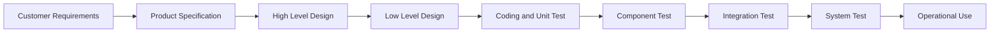
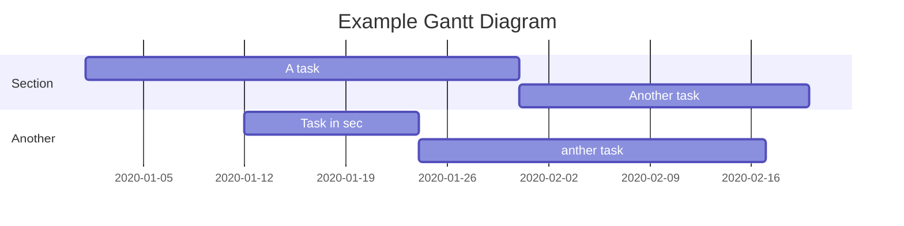
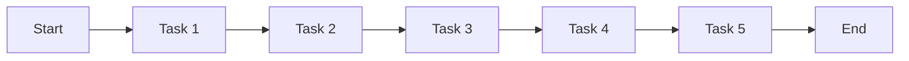
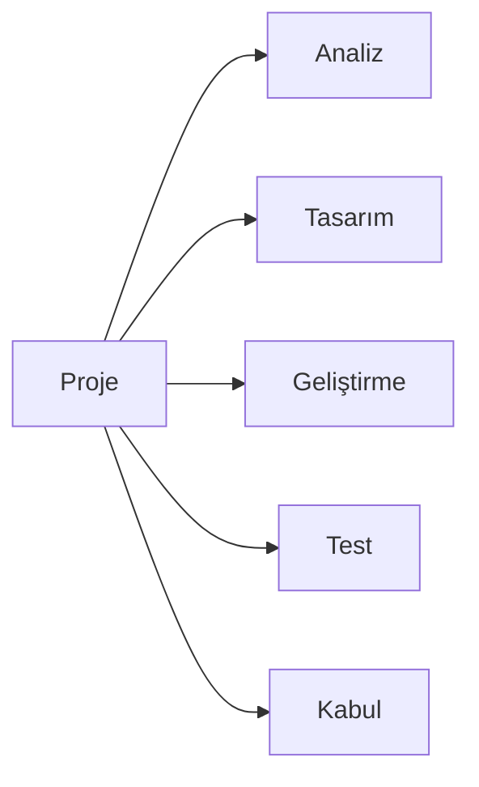
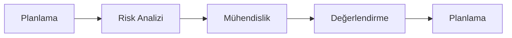

# [Doğal Dil İşlemeye Kavramsal Bir Bakış](#1-doğal-dil-i̇şlemeye-kavramsal-bir-bakış)

# [Yazılım Kalitesi ve Test Teknikleri](#2-yazılım-kalitesi-ve-test-teknikleri)

# [Yazılım Proje Yönetimi](#3-yazılım-proje-yönetimi)

# [Nesneye Dayalı Tasarım ve Modelleme](#4-nesneye-dayalı-tasarım-ve-modelleme)

# Veri Madenciliği ve Bilgi Keşfi

# Veri Sıkıştırma

# İleri Bilgisayar Mimarisi

## 1. Doğal Dil İşlemeye Kavramsal Bir Bakış

- Doğal Dil İşlemeye Genel Bakış (Course Overview)
  - Morfoloji, Syntax, Semantik, Pragmatik, Discource
- Dilbiliminin Esasları (Linguistics Essentials)
  - Chomsky hiyerarşisi; türetme ağacı; parsing cümlenin öğlelerine ayırma
  - Dil tipleri;
    - Tip 0 => Kuralların hiçbir kısıtlaması yoktur. (Turing Makinesi)
    - Tip 1 => Kuralların sol tarafında en fazla bir terminal sembol bulunur. (Kontekst Duyarlı Gramer)
    - Tip 2 => Programlama Dilindeki Context Free Grammer (CFG)
    - Tip 3 => Regular Expression (Regex) en fazla kural burada kullanılır.
- Gramer ve Diller (Grammer and Language)
  $$ G = <V_N, V_T, S, P> $$
  - V_N => Nonterminal semboller kümesi (Dildeki kelimeler, sözlük)
  - V_T => Terminal semboller kümesi (Dildeki kelimelerin türleri)
  - S => Başlangıç sembolü
  - P => Üretim kuralları
- Düzenli Diller (Regular Expression)
  - Örnek işaretler:
  - `+`: 1 veya daha fazla
  - `*`: 0 veya daha fazla
  - `?`: 0 veya 1
  - `.`: herhangi bir karakter
  - `|`: veya
  - `^`: başlangıç
  - `$`: bitiş
  - `[A-Za-z0-9]`: karakter kümesi
  - `()`: gruplama
  - `[^]`: karakter kümesi dışı
  - `{n}`: n kere
  - `\`: kaçış karakteri
- Biçimbilimsel Analiz (Morphological Analysis)
  - Morfolojik Analiz
  - Kök Belirleme Adımları
    - Stemming: Kelimenin kökünü bulma
      - Kelimenin sonundan harfleri atarak bulduğumuz kelimenin kök sözlüğünde olup olmadığını kontrol ederiz. Eğer varsa attığımız harflerden oluşan yapı ek sözlüğünde var mı yok mu. Eğer varsa kelimenin kökü bulunmuştur. Kelimenin kökü bulununcaya kadar bu işlemi tekrarlarız.
      ```mermaid
        graph LR
            A[Running] --> B[Stemming]
            B --> C{Is it in the dictionary?}
            C --> |Yes| D[Stem found]
            C --> |No| E[Stem not found]
            E --> F[Remove suffix]
            F --> B
      ```
    - Lemmatization: Kelimenin sözlükteki karşılığını bulma
- Sözdizimsel Analiz - POS (Syntax Analysis - Part of Speech Tagging)
  - Cümledeki kelimelerin türlerini bulma
  - Parsing: Cümleyi öğelerine ayırma
- Dil Modelleri N-Grams (Language Models)
  - Dil modelleri, bir cümledeki kelimelerin birbirleriyle olan ilişkilerini belirlemek için kullanılır. Örneğin, "Ben evdeyim" cümlesindeki "evdeyim" kelimesinin "Ben" kelimesinden sonra gelebileceğini bilmek için dil modelleri kullanılır.
  - Türleri: N-Grams, Hidden Markov Model, Maximum Entropy Model, Conditional Random Fields (CRF)
  - N-Grams: n-1 kelimeye bakarak bir kelimenin gelebileceği olasılığını bulma
  - Hidden Markov Model: Bir kelimenin gelebileceği olasılığı bulmak için bir önceki kelimeye bakar. N-Grams'dan farkı, bir kelimenin gelebileceği olasılığı bulmak için bir önceki kelimeye bakmasıdır. N-Grams'da ise n-1 kelimeye bakılır.
  - Dezavantajları: İşlem maliyeti yüksek, veri az olduğunda doğruluk düşük, bağlamı dikkate almaz.
- Anlam Bilgisi (Semantik)
  - WordNet (Anlam Bilgisi): Kelimelerin anlamlarını bulmak için kullanılır. Örneğin, "ev" kelimesinin anlamı "Bir veya daha fazla kişinin yaşadığı yapı" olarak tanımlanabilir. WordNet'te kelimelerin anlamları, anlamların birbirleriyle olan ilişkileri, kelimelerin eş anlamlıları, kelimelerin zıt anlamlıları, kelimelerin kullanım alanları gibi bilgiler bulunur.
- Kelime Gösterimleri (Word Representation) Kelime Gömmeleri (Word Embeding)
  - OneHot Encoding
  - Bag of Words
  - TF-IDF
  - Word2Vec: (CBOW, Skip-Gram)
    - FastText
    - Glove
    - ELMo
    - BERT
- Makine Öğrenmesi (Machine Learning)
  - Supervised Learning
  - Unsupervised Learning
  - Reinforcement Learning
  - Metin Sınıflandırma (Text Classification)
    - Naive Bayes
    - SVM
    - Decision Tree
    - Random Forest
    - KNN
    - Logistic Regression
    - Neural Networks
- Metin Sınıflandırma (Text Classification)
  - Add-One Smoothing
  - Add-k Smoothing
  - Good-Turing Smoothing
  - Backoff: Büyük n-gramlar için küçük n-gramlara bakma
- Bilgiye Erişim Sistemleri (Information Retrieval)

  - TF-IDF: Term Frequency - Inverse Document Frequency (Kelime Sıklığı - Ters Belge Sıklığı) Formülü:

    $$ TF-IDF(t,d) = TF(t,d) x IDF(t) $$

    - TF(t,d): t kelimesinin d belgesindeki sıklığı
    - IDF(t): t kelimesinin tüm belgelerdeki sıklığı formülü:

    $$ IDF(t) = log(\frac{N}{DF(t)}) $$

    - N: Toplam belge sayısı
    - DF(t): t kelimesinin kaç belgede geçtiği

  - Cosine Similarity
  - PCA: Principal Component Analysis (Temel Bileşen Analizi)
  - LDA: Latent Dirichlet Allocation (Gizil Dirichlet Dağılımı)
  - LSI: Latent Semantic Indexing (Gizil Anlamsal İndeksleme) işlem adımları:
    - TF-IDF matrisi oluşturulur.
    - TF-IDF matrisi SVD ile azaltılır.
    - Azaltılmış matris üzerinde k-means algoritması uygulanır.

- Bilgi Çıkarımı (Information Extraction)
- Eşdizimlilik (Collocation)
- Soru Cevaplama Sistemleri (Question Answering)

1. ~~doğal dil işleme ana başlıkları~~
2. ~~Chomsky hiyerarşisi~~
3. ~~türetme ağacı~~
4. ~~parsing cümlenin öğlelerine ayırma~~
5. ~~regex~~
6. ~~morfolojik analiz~~
7. ~~kök belirleme adımları~~
8. ~~dil modeli nedir amacı nerelerde kullanılır~~
9. ~~zipf yasası~~
10. ~~Markov yaklaşımı~~
11. ~~yumuşatma teknikleri~~
12. ~~lesk algoritması~~
13. ~~wordnet~~
14. ~~kelime gösterimleri one hot vs~~
15. ~~kelime gömmeleri word2vec fasttext vs~~
16. text classification pipelines
17. cosine similarity
18. ~~pca, lda,lsi~~
19. metin ağaçları TRIE suffix tree
20. minimum edit distance
21. ~~tf ıdf hesabı~~
22. sensivity specificity recall metrics

[Başa Git](#1-doğal-dil-i̇şlemeye-kavramsal-bir-bakış)

## 2. Yazılım Kalitesi ve Test Teknikleri

- Yazılım Kalite Faktörleri McCall Kalite Üçgeni

  - Değişime Uyum
  - Taşınabilirliği
  - Kullanımı Kolaylık

- Yazılım Kalite Sağlama Aktiviteleri

  - Standartlar
  - Geçerleme (Validation) ve Doğrulama (Verification)
  - Statik Verification ve Dinamik Verification
  - Gözden Geçirme (Review) ve Denetim (Audit)
  - Test
  - Hata Kusur Analizi (Fault Defect Analysis)
  - Değişim Yönetimi Konfigürasyon Yönetimi (Change Management Configuration Management)
  - Eğitim
  - Risk Yönetimi

- V Model Yaklaşımı

  - Müşteri Gereksinimleri
  - Ürün Spesifikasyonu (Özellikleri)
  - Yüksek Düzey Tasarım
  - Alçak Düzey Tasarım
  - Kodlama ve Birim Testi
  - Bileşen Test
  - Bütünlük Testi
  - Sistem Testi
  - İşlemsel Kullanım



- Gözden Geçirme ve İncelem Tipleri

  - Formal Olmayan İnceleme
  - Yapısal Denetim (Walkthrough)
  - İnceleme
  - Round Robin Peer Review

- Gözden Geçirme ve Onaylama Basamakları

  - Sistem Analizi
  - Yazılım Geliştirme Planı
  - Gereksinim Analizi
  - Tasarım
  - Kodlama
  - Sınama
  - Bakım ve Onarım

- Yazılım Sınama ve Test

  - Test: Yazılımın belirli bir girdiye verilen belirli bir çıktıyı üretip üretmediğini kontrol etme işlemidir. Türleri:
  - Fonksiyonel Test
  - Performans Test
  - Dayanıklılık Testi
  - Yapısal Test

  - Birim Test: Yazılımın en küçük parçasının doğru çalışıp çalışmadığını kontrol etme işlemidir.
  - Bütünleme Testi: Yazılımın birimlerinin bir arada doğru çalışıp çalışmadığını kontrol etme işlemidir. Yüksek Düzey Tasarım aşamasında planlanır. Bütün olarak ve artırmalı olarak yapılır. Artırımlı test yukarıdan aşağı ve aşağıdan yukarı yapılır.
  - Regresyon Testi: Yazılımın yeni bir değişiklik yapıldıktan sonra eski özelliklerinin doğru çalışıp çalışmadığını kontrol etme işlemidir.
  - Sistem Testi: Yazılımın tümünün doğru çalışıp çalışmadığını kontrol etme işlemidir. Sistem Testi türleri:

    - Güvenlik Testi
    - Performans Testi
    - Dayanıklılık Testi

  - Saydam kutu temel yollar testi: Test programları her bir deyimi en az bir kez deneyerek ilerler. Uygulama: ayrıntılı tasarıma dayanarak akış grafikleri oluşturulur. Her bir deyim için bir kutu oluştur.
  - Kara kutu testi: Yöntemleri; eş değer bölütleme, neden sonuç grafikleri, karar tabloları, karar tabanlı testler, sınır değer analizi.
  - Smoke test: yazılımın temel işlevlerinin doğru çalışıp çalışmadığını kontrol etme işlemidir.

- Test Yönetimi Süreci

  - Test Planlama
  - Test Tasarımı
  - Test Uygulama
  - Test Raporlama
  - Test İzleme ve Kontrol

- Yazılım Kalite Ölçütleri
  - McCall Kalite Üçgeni: Değiştirilebilirlik, Geçişlilik, İşlemsellik
  - Nesne Odaklı Kalite Ölçütleri: Chidamber ve Kemerer

[Başa Git](#2-yazılım-kalitesi-ve-test-teknikleri)

## 3. Yazılım Proje Yönetimi

- A->T->G->T

  - A: Analiz
  - T: Tasarım
  - G: Geliştirme
  - T: Test

- Yazılım Geliştirme Yaşam Döngüsü (YGYD)

  - Su Dalgası Modeli
  - Çevik Yazılım Geliştirme
  - Spiral Model
  - XP (Extreme Programming)

- 3P: People, Process, Problem
- Proje Yönetiminin Üç Temel Bileşeni:

  - Proje Yönetimi bilgi ve deneyimi
  - Genel YÖnetim bilgi ve deneyimi
  - Yazılım Müşterisi bilgi ve deneyimi

- Genel Yönetim Adımları: Planlamadan Önce -> Proje Yönetim Planı -> Plamadan Sonra
- Başarı Kriterleri: Zaman-Maliyet-Kapsam-Kalite
- Proje Yönetim Planı: Proje Tanımı, Proje Organizasyonu, Proje Yönetim Yaklaşımı, Proje Kontrolü, Proje Riskleri, Proje İletişimi, Proje Kalite Planı, Proje Dokümantasyonu, Proje Standartları, Proje Donanımı, Proje Yazılımı, Proje İnsan Kaynakları, Proje Eğitimi, Proje İş Planı, Proje İzleme ve Kontrol, Proje Değişiklik Yönetimi, Proje Kapatma
- Başarısızlık Nedenleri:

  - Yönetim tarafından desteklenmemesi
  - Yetersiz planlama

- Proje Yönetim Süreci: Başlangıç -> Planlama -> Uygulama -> Kontrol -> Kapatma
- Maliyet Tahmin Yöntemleri:

  - Bilirkişi takdiri
  - Delphi yöntemi
  - Analiz tabanlı yöntemler
  - COCOMO (Constructive Cost Model) İstatistiksel model:
    - Basit model formülü: $$ E = a x (KLOC)^b $$
    - Orta model formülü: $$ E = a x (KLOC)^b x EAF $$
    - İleri model formülü: $$ E = a x (KLOC)^b x EAF x (1.01)^{TDEV} $$
    - E: Çalışma saati
    - KLOC: Bin satır kod
    - EAF: Çarpan faktörü: 0.9-1.4 arasında değişir.
    - TDEV: Geliştirme süresi: 2.5-0.38 arasında değişir.

- Yazılım Büyüklük Ölçütleri:

  - Dolaylı Ölçütler: Fonksiyon Noktası (FN), Güvenirlik, Verimli, Kullanılabilirlik, Esneklik, Taşınabilirlik, Test Edilebilirlik
  - Doğrudan Ölçütler: KLoc (Kilo Line of Code), Gider (Cost), Süre (Time)

- Proje Zamanlama Araçları:
  - Gantt Şeması
    - SS: Start to Start
    - SF: Start to Finish
    - FS: Finish to Start
    - FF: Finish to Finish



- PERT (Program Evaluation and Review Technique): En erken başlama zamanı, en geç başlama zamanı, en erken bitiş zamanı, en geç bitiş zamanı, toplam süre, serbest süre, kritik yol örnek:



- WBS (Work Breakdown Structure): Projenin parçalara ayrılması. Örnek:



- Proje Riskleri: Teknik Riskler, İş Riskleri, Yönetim Riskleri, İnsan Kaynakları Riskleri, Mali Riskler, Çevresel Riskler

- Waterfall Model: Analiz -> Tasarım -> Geliştirme -> Test -> Bakım
- Spiral Model: Planlama -> Risk Analizi -> Mühendislik -> Değerlendirme



[Başa Git](#3-yazılım-proje-yönetimi)

## 4. Nesneye Dayalı Tasarım ve Modelleme

- Code Smells
  - Bloaters
    - Long Method
    - Large Class
    - Primitive Obsession
    - Long Parameter List
    - Data Clumps
  - Object-Orientation Abusers
    - Switch Statements
    - Temporary Field
    - Refused Bequest
    - Alternative Classes with Different Interfaces
  - Change Preventers
    - Divergent Change
    - Shotgun Surgery
    - Parallel Inheritance Hierarchies
  - Dispensables
    - Comments
    - Duplicate Code
    - Lazy Class
    - Data Class
    - Dead Code
    - Speculative Generality
  - Couplers
    - Feature Envy
    - Inappropriate Intimacy
    - Incomplete Library Class
    - Middle Man
    - Message Chains
- Refactoring Techniques

  - Composing Methods
    - Extract Method
    - Inline Method
    - Inline Temp
    - Replace Temp with Query
    - Introduce Explaining Variable
    - Split Temporary Variable
    - Remove Assignments to Parameters
    - Replace Method with Method Object
    - Substitute Algorithm
  - Moving Features Between Objects
    - Move Method
    - Move Field
    - Extract Class
    - Inline Class
    - Hide Delegate
  - Organizing Data
    - Self Encapsulate Field
    - Replace Data Value with Object
    - Change Value to Reference
    - Change Reference to Value
    - Replace Array with Object
    - Duplicate Observed Data
    - Change Unidirectional Association to Bidirectional
    - Change Bidirectional Association to Unidirectional
    - Replace Magic Number with Symbolic Constant
    - Encapsulate Field
    - Encapsulate Collection
    - Replace Record with Data Class
    - Replace Type Code with Class
    - Replace Type Code with Subclasses
    - Replace Type Code with State/Strategy
    - Replace Subclass with Fields
    - Extract Subclass
    - Extract Superclass
    - Extract Interface
    - Collapse Hierarchy
    - Form Template Method
    - Replace Inheritance with Delegation
    - Replace Delegation with Inheritance
    - Replace Conditional with Polymorphism
    - Introduce Null Object
    - Introduce Assertion
  - Simplifying Conditional Expressions
    - Decompose Conditional
    - Consolidate Conditional Expression
    - Consolidate Duplicate Conditional Fragments
    - Remove Control Flag
    - Replace Nested Conditional with Guard Clauses
    - Replace Conditional with Polymorphism
    - Introduce Null Object
    - Introduce Assertion
  - Simplifying Method Calls
    - Rename Method
    - Add Parameter
    - Remove Parameter
    - Separate Query from Modifier
    - Parameterize Method
    - Replace Parameter with Explicit Methods
    - Preserve Whole Object
    - Replace Parameter with Method
    - Introduce Parameter Object
    - Remove Setting Method
    - Hide Method
    - Replace Constructor with Factory Method
    - Replace Error Code with Exception
    - Replace Exception with Test
    - Introduce Foreign Method
    - Introduce Local Extension
  - Dealing with Generalization
    - Pull Up Field
    - Pull Up Method
    - Pull Up Constructor Body
    - Push Down Method
    - Push Down Field
    - Extract Subclass
    - Extract Superclass
    - Extract Interface
    - Collapse Hierarchy
    - Form Template Method
    - Replace Inheritance with Delegation
    - Replace Delegation with Inheritance
    - Replace Type Code with Class
    - Replace Type Code with Subclasses
    - Replace Type Code with State/Strategy
    - Replace Subclass with Fields
    - Extract Interface
    - Collapse Hierarchy
    - Form Template Method
    - Replace Inheritance with Delegation
    - Replace Delegation with Inheritance
    - Replace Type Code with Class
    - Replace Type Code with Subclasses
    - Replace Type Code with State/Strategy
    - Replace Subclass with Fields
    - Extract Interface
    - Collapse Hierarchy
    - Form Template Method
    - Replace Inheritance with Delegation
    - Replace Delegation with Inheritance
    - Replace Type Code with Class
    - Replace Type Code with Subclasses
    - Replace Type Code with State/Strategy
    - Replace Subclass with Fields
    - Extract Interface
    - Collapse Hierarchy
    - Form Template Method
    - Replace Inheritance with Delegation
    - Replace Delegation with Inheritance
    - Replace Type Code with Class
    - Replace Type Code with Subclasses
    - Replace Type Code with State/Strategy
    - Replace Subclass with Fields
    - Extract Interface
    - Collapse Hierarchy
    - Form Template Method
    - Replace Inheritance with Delegation
    - Replace Delegation with Inheritance
    - Replace Type Code with Class
    - Replace Type Code with Subclasses
    - Replace Type Code with State/Strategy
    - Replace Subclass with Fields
    - Extract Interface

- Creational Design Patterns
  - Abstract Factory
  - Builder
  - Factory Method
  - Prototype
  - Singleton
- Structural Design Patterns
  - Adapter
  - Bridge
  - Composite
  - Decorator
  - Facade
  - Flyweight
  - Proxy
- Behavioral Design Patterns
  - Chain of Responsibility
  - Command
  - Interpreter
  - Iterator
  - Mediator
  - Memento
  - Observer
  - State
  - Strategy
  - Template Method
  - Visitor

[Başa Git](#4-nesneye-dayalı-tasarım-ve-modelleme)

## 5. Veri Madenciliği ve Bilgi Keşfi

- Preprocessing
  - Data Cleaning
    - Missing Values
    - Noisy Data
    - Outliers
  - Data Integration
  - Data Transformation
    - Normalization
      - Min-Max Normalization
      - Z-Score Normalization
      - Decimal Scaling
      - Binning
    - Aggregation
    - Generalization
    - Discretization
  - Data Reduction
    - Feature Selection
    - Feature Extraction
      - Principal Component Analysis (PCA)
- Classification
  - Decision Tree
  - Naive Bayes
  - K-Nearest Neighbors (KNN)
  - Support Vector Machine (SVM)
- Clustering
  - K-Means
  - Hierarchical Clustering
- Association Rule Mining
  - Apriori Algorithm
